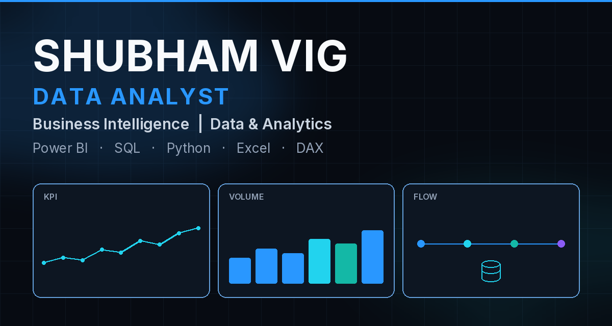
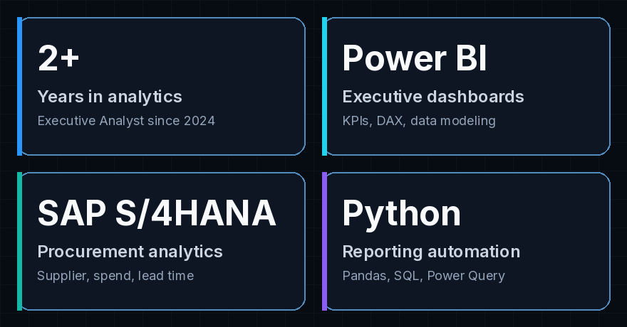
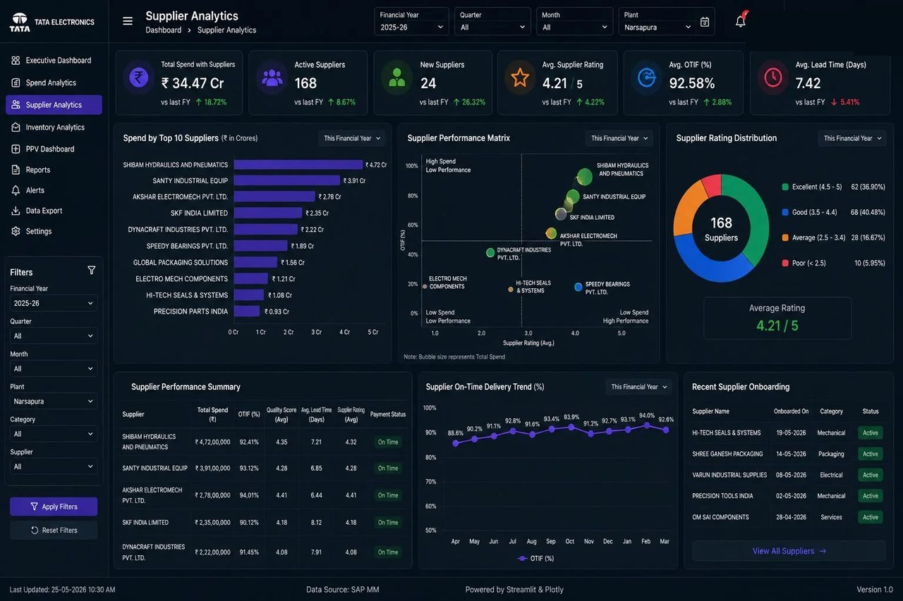
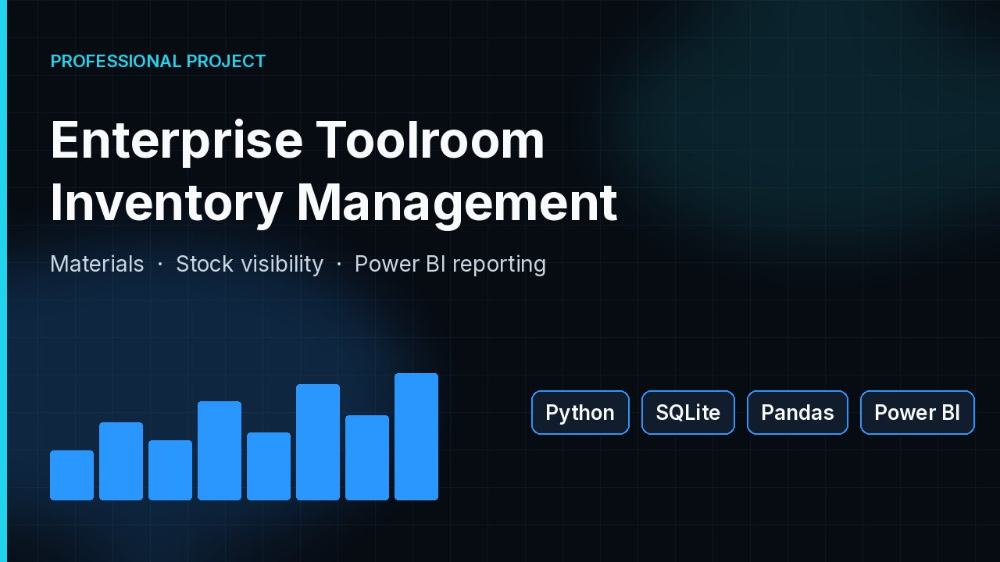
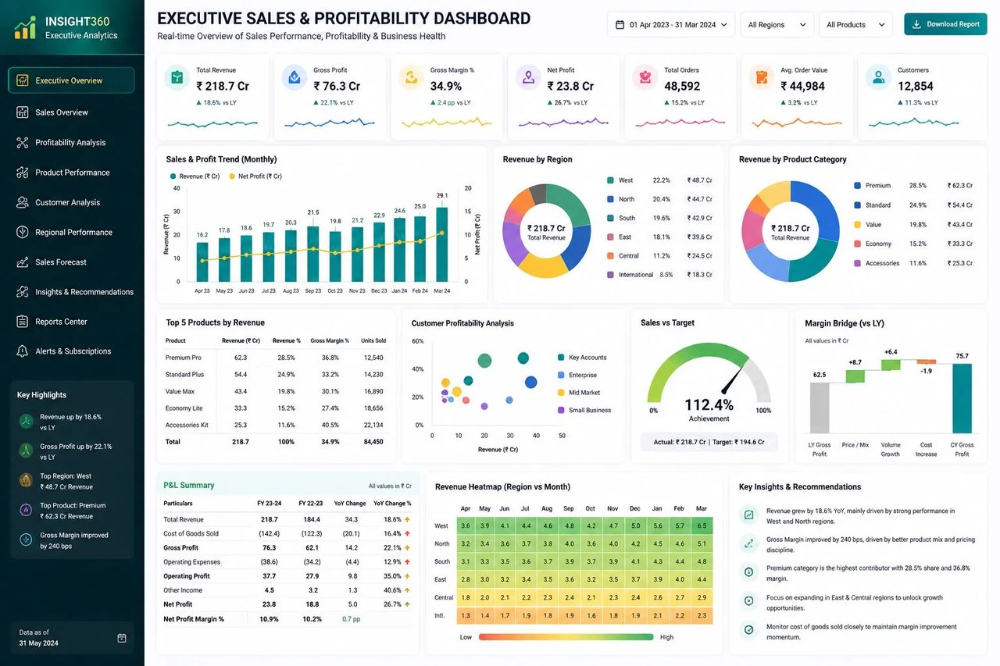
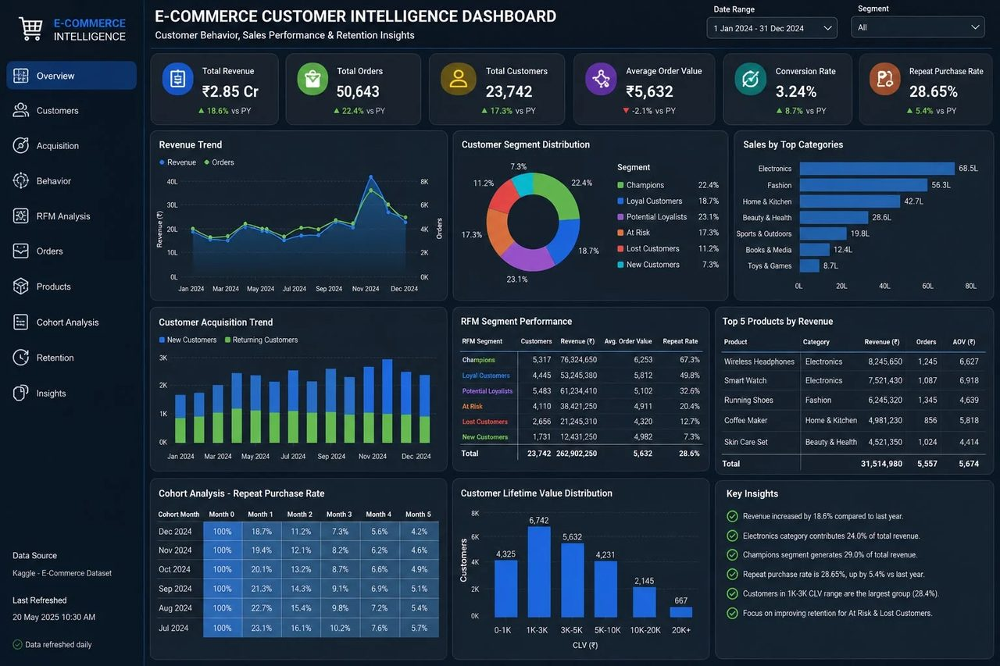
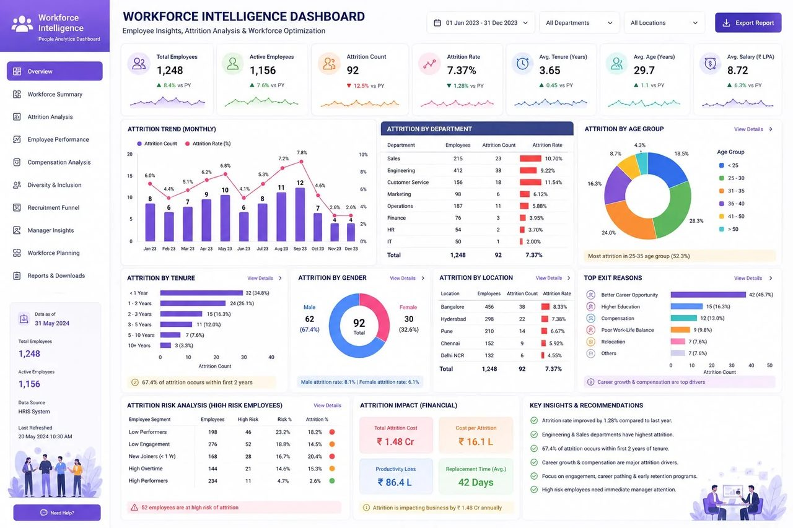

  

# Shubham Vig

**Data Analyst**

Business Intelligence | Data & Analytics

Power BI · SQL · Python · Excel · DAX

Executive Analyst II at Tata Electronics in Bengaluru. I work with procurement, production, inventory and supply chain data, and turn it into Power BI dashboards, SQL and Python analysis, and reports teams can act on.

  
  &nbsp;
  
  &nbsp;
  

  

## About

I sit between the business question and the enterprise data. At Tata Electronics (July 2024 – Present) that means procurement, production, inventory and supply chain: find the pattern that matters, then turn it into a dashboard, a model or a recommendation.

From SAP S/4HANA tables to Power BI, the work is practical. I clean and model operational data, track production KPIs such as productivity, OEE, yield, downtime and quality, and look at supplier performance, purchase price variance and lead time. Recurring reporting is automated with Python, Excel VBA and Power Query — work that cut manual reporting effort by 60%.

## Core skills

  
  &nbsp;
  
  &nbsp;
  
  &nbsp;
  
  &nbsp;
  
  &nbsp;
  
  &nbsp;
  

**Data analytics**  
SQL · Python · Pandas · NumPy · Statistics · Excel

**Business intelligence**  
Power BI · DAX · Power Query · Data modeling · Dashboard development

**Enterprise analytics**  
SAP S/4HANA · Procurement analytics · Supply chain analytics · Inventory analytics · Supplier analytics

**Automation**  
Python automation · Streamlit · Tkinter · SQLite · Git · GitHub

## What I do

**Business intelligence**  
Interactive Power BI dashboards, DAX, data modeling and KPI reporting for leadership — including production metrics such as productivity, OEE, yield, downtime and quality.

**Data analytics**  
SQL and Python for cleaning, exploratory analysis and KPI work. Pandas and NumPy where the analysis needs to go past the spreadsheet.

**Procurement and inventory**  
SAP S/4HANA analysis of supplier performance, purchase price variance and lead time, plus consumption, stockout exposure, inventory turnover and tool utilization.

**Automation and reporting**  
Python, Excel VBA and Power Query for recurring business reports, with Streamlit and SQLite where a small internal tool is the right interface.

## Featured projects

These case studies are on the portfolio. They are not published as public GitHub repositories, so there is no repository link to attach.

### Enterprise Procurement Intelligence Platform

Procurement was spread across SAP extracts and Excel reports, so supplier performance, purchasing trends and cycle time were hard to see together. This brings spend, supplier and procure-to-pay monitoring into one place, and flags where cost can come out.

`Python` `SQL` `Streamlit` `Power BI` `Scikit-learn` `SAP`

[View case study](https://shubhamvig.netlify.app/)

### Enterprise Toolroom Inventory Management System

Separate Excel trackers were duplicating entries and hiding real consumption. A single inventory record covers material movement, audit history and low stock, with Power BI used for replenishment reporting.

`Python` `SQLite` `Tkinter` `Pandas` `Power BI` `Git`

[View case study](https://shubhamvig.netlify.app/)

### Executive Sales & Profitability Intelligence

Personal analytics project. Sales, finance and regional reports sit apart, so it is hard to tell whether growth is profitable or where margin is leaking. One executive view ties revenue, margin, product, customer and region together.

`SQL` `Python` `Power BI`

[View case study](https://shubhamvig.netlify.app/)

### E-Commerce Customer Intelligence

Personal analytics project. Revenue can grow without showing which customers drive it, who is drifting, or where retention spend will pay back. The analysis covers behavior, RFM segments, cohorts and lifetime value.

`SQL` `Python` `Power BI`

[View case study](https://shubhamvig.netlify.app/)

### Workforce Intelligence

Personal analytics project. Attrition usually shows up after people have left. This segments who is at risk, where turnover concentrates, and what that turnover costs.

`SQL` `Python` `Power BI`

[View case study](https://shubhamvig.netlify.app/)

## How I work

1. Business problem
2. Collect
3. Clean
4. SQL and Python
5. Data modeling
6. Power BI
7. Insights
8. Recommendations

Start from the decision that needs to change. Clean and model before the dashboard. A Power BI view only counts if someone uses it.

## Current focus

Advanced Power BI and DAX · Python analytics and reporting automation · SAP S/4HANA procurement analytics · Data modeling for KPI reporting

## GitHub

Analytics delivery for this role lives in dashboards, SAP analysis and internal Python tools, so it does not all appear as public commits. Older repositories here are mostly earlier software projects.

[github.com/im-shubham](https://github.com/im-shubham)

## Let's connect

Open to conversations on data analytics, business intelligence, dashboard development and reporting.

  
  &nbsp;
  
  &nbsp;
  

